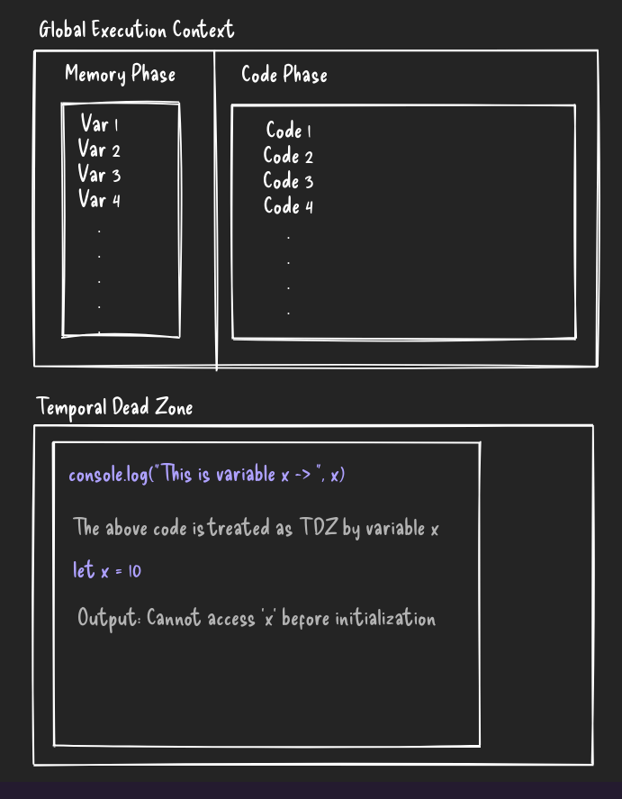

# How JS Works Internally (Part 1)

> [Previous (JavaScript-Core)](./0-CORE.md) || [Next (Call Stack & Event Loop)](./2-CS-EL.md)

## Global Execution Context

- Whenever we execute JavaScript code, a **Global Execution Context** (GEC) is created.
- The **GEC** consists of two partitions: the `Memory Phase` and the `Code Phase`.

  - **Memory Phase (MP)**: This phase is responsible for storing all variables and function declarations by traversing through the code.
  - **Code Phase (CP)**: This phase stores all the executable code and references variables from the Memory Phase.

### For Normal Single-Line Code

- JavaScript first traverses through the code and stores all variables in the **Memory Phase** (MP).
- The values of variables stored in **MP** are initially set to **undefined**.
- In the **Code Phase**, JavaScript reads and executes the code line by line. If it encounters a variable, it looks up its value in the **Memory Phase** (MP).
- Once the code is executed successfully, the output is displayed to the developer, and the **GEC** gets deleted.

### For Function-Based Code

- In the **Memory Phase**, variables are stored as **undefined**, and functions are stored as the **complete function body**.
- When a function is called in the **Code Phase**, a new **internal GEC** is created inside the main **GEC**. This internal **GEC** has its own **Memory Phase** (MP) and **Code Phase** (CP).
- The internal **Memory Phase** (MP) stores variables as undefined, and the **Code Phase** (CP) executes the function’s code line by line.
- After the internal **GEC** executes, it is removed from the stack.
- If you declare and call a simple function, regardless of its position in the code, it will get executed correctly.

```js
// Called First
globalFunction();

// Declared as a function later
function globalFunction() {
  console.log("Inside Global Function");
}

// Output: Inside Global Function
```

- However, if you assign a function to a variable and then call it before the assignment, it will result in an error because the variable is hoisted as undefined initially.

```js
// Called First
globalFunction();

// console.log(globalFunction) -> undefined

// Declared as a variable later
const globalFunction = function () {
  console.log("Inside Global Function");
};

// Output: globalFunction is not a function
```

## Temporal Dead Zone (TDZ)

- Variables declared with `var`, `let`, and `const` are all hoisted, but only `var` will not throw an error if accessed before its declaration.
- When using `let` and `const`, a **Temporal Dead Zone (TDZ)** is created, meaning the code before the variable’s declaration cannot access the variable. Attempting to do so will throw an error.
- During the **TDZ**, the variable is **hoisted but cannot be accessed**.

```js
console.log(x);
// The above code is treated as TDZ by the variable 'x'

let x = 10;

// Output: Cannot access 'x' before initialization
```

- In the example above, in the **GEC**, the value of `x` is hoisted as `undefined` (as is typical with variable hoisting).
- The use of the `let` or `const` keyword creates a **TDZ**, preventing access to the variable before it is initialized.

## Why Does TDZ Exist?

- **TDZ** exists to prevent bugs and logical errors in your code. Without it, JavaScript would allow access to variables before they are initialized, leading to unexpected behaviors.
- By enforcing this rule, JavaScript makes sure that you can’t accidentally use a variable before it is properly assigned a value, which can be critical for reliable and predictable code execution.

## Preview



### [Previous (JavaScript-Core)](./0-CORE.md) || [Next (Call Stack & Event Loop)](./2-CS-EL.md)
