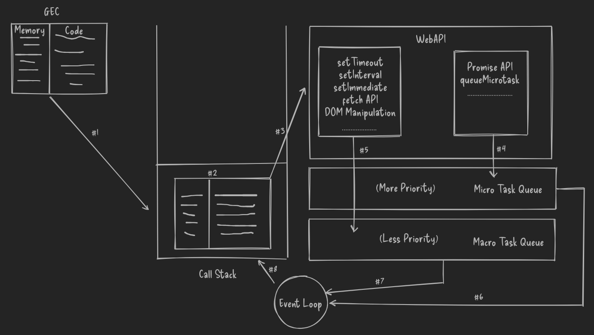

# How JS Works Internally (Part 2)

> [Previous (Global Execution Context & Temporal Dead Zone)](./1-GEC-TDZ.md)

- We know that JavaScript code, for execution, creates the `Global Execution Context` (GEC).
- For running this code, we need an engine, i.e., **JS Engine**.
- The JS Engine is the environment that executes JavaScript code.

## Call Stack

- The **Call Stack** is a **LIFO (Last In, First Out)** stack that stores execution contexts, representing function calls.
- When a function is called, its execution context is pushed onto the stack, and when the function completes, its context is popped off.
- **Call Stack Rules**:
  - The code gets pushed into the Call Stack for execution.
  - The Call Stack waits for nothing—if it has an element, it immediately starts execution.
  - Once the function execution is completed, the corresponding execution context is removed (popped) from the stack.
- The code we want to execute creates a **Global Execution Context** (GEC), and this entire GEC is pushed onto the Call Stack.

### Normal Example: Code Execution Flow

```js
console.log("Start Script");

setTimeout(() => {
  console.log("This task came from Task Queue");
}, 5000);

console.log("End Script");

/* Output:
    Start Script
    End Script
    This task came from Task Queue
*/
```

- In the above example, `setTimeout` is executed last, despite its delay of 5000 milliseconds.
- setTimeout does not belong to JavaScript execution—it is part of the **WebAPI**.

## WebAPI

- **WebAPIs** are browser-provided APIs that run outside the JavaScript runtime environment.
- When the **GEC** inside the Call Stack encounters code that requires a WebAPI (e.g., `setTimeout`, `fetch`), the code is handed off to the WebAPI to be executed asynchronously, and the Call Stack continues executing the remaining code without waiting.
- Once the WebAPI task is completed, it sends the task to the **Task Queue** for further processing.

## Task Queue (a.k.a. Macrotask Queue)

- Tasks completed by WebAPIs are placed in the **Task Queue**, where they wait for the main Call Stack to become empty before being moved back to the Call Stack for execution.
- To monitor whether the Call Stack is empty, the **Event Loop** checks continuously.
- **Examples of tasks handled by the Macrotask Queue**:
  - setTimeout
  - setInterval
  - setImmediate (Node.js)
  - fetch API requests

## Micro Task Queue (Higher Priority)

- The **Micro Task Queue** has higher priority than the Task Queue and is checked after every execution of the Call Stack.
- **Examples of tasks handled by the Micro Task Queue**:
  - Promise resolution (`Promise.then()`, `Promise.catch()`, `Promise.finally()`)
  - `queueMicrotask()` (in browsers or Node.js)

### For Micro Task Example

```js
console.log("Start Script");

setTimeout(() => {
  console.log("This task came from Task Queue");
}, 5000);

Promise.resolve().then(() => {
  console.log("This task came from the MicroTask Queue");
});

console.log("End Script");

/* Output:
    Start Script
    End Script
    This task came from the MicroTask Queue
    This task came from Task Queue
*/
```

- In the above example, despite `setTimeout` having a 5000ms delay, the Promise resolves immediately and its `.then()` callback is executed first because it is placed in the Micro Task Queue.
- The **Task Queue** waits until all Micro Tasks are processed before executing.

## Event Loop

- The **Event Loop** is the mechanism that continuously monitors the **Call Stack** and checks if it is empty.
- When the Call Stack is empty, the Event Loop moves tasks from the **Task Queue** (macrotasks) or **Micro Task Queue** to the Call Stack for execution.
- The Event Loop ensures that all tasks in the Micro Task Queue are processed before moving tasks from the Task Queue to the Call Stack.

## Preview



### [Previous (Global Execution Context & Temporal Dead Zone)](./1-GEC-TDZ.md)
